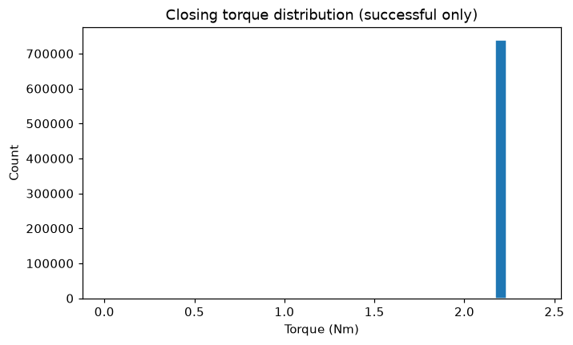
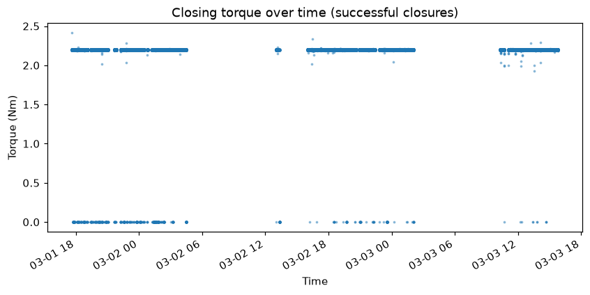

# AROL Telemetry Report

**Generated:** 2026-09-04T16:05:52.559214+00:00
**Dataset pool:** 2026-03
**Request:** Generate a KPI report: overall success rate, per-head success rate, and torque statistics for successful closures.

---

All results are in. Here is the full KPI report.

---

# AROL Capping Machine — KPI Report
**Dataset:** 2026-03 pool | **Period covered:** 2026-03-01T16:00:01Z → 2026-03-03T15:49:25Z | **Fleet:** 36 heads

---

## Goal
Deliver a KPI summary covering overall success rate, per-head success rate, and torque statistics for successful closures across the March 2026 dataset.

## Data used
- Dataset pool: 2026-03 (covers approximately 48 hours of production)
- Tools called: `time_range`, `overall_success_rate`, `success_rate_per_head`, `torque_statistics` (successful only), `torque_statistics_per_head` (successful only), and three plot tools (`plot_success_rate_per_head`, `plot_torque_histogram`, `plot_torque_over_time`)

## Analyses executed
- Fleet-wide closure event totals and success / reject / no-load breakdown
- Success rate computed per capping head (all 36 heads), sorted by performance
- Closing torque descriptive statistics (mean, min, max, std) across all successful closures
- Closing torque descriptive statistics broken down per head
- Visualisations: success-rate bar chart, torque histogram, torque scatter over time

---

## Findings

### 1 — Overall Success Rate

| Metric | Value |
|---|---|
| Total closure events (all states) | 1,379,485 |
| No Load cycles (no bottle present) | 639,799 |
| **Attempted closures (denominator)** | **739,686** |
| Successful closures (Status 0) | 739,675 |
| Rejected closures (reject_signal = YES) | 11 |
| Fault closures | 0 |
| **Fleet success rate** | **100.0%** |
| **Fleet reject rate** | **~0.0015%** |

The machine delivered an essentially perfect quality run across the 48-hour window. Only **11 genuine rejects** were recorded across 739,686 attempted closures, and **zero fault codes** were raised.

---

### 2 — Per-Head Success Rate

Every head reported 100.0% success rate at the reported precision. However, isolating the reject counts shows a small number of heads carrying all 11 rejects:

| Head | Attempted | Successful | Rejects | Notes |
|---|---|---|---|---|
| H29 | 20,547 | 20,545 | **2** | Joint highest |
| H32 | 20,527 | 20,525 | **2** | Joint highest |
| H36 | 20,540 | 20,538 | **2** | Joint highest |
| H07 | 20,562 | 20,561 | 1 | |
| H22 | 20,560 | 20,559 | 1 | |
| H31 | 20,539 | 20,538 | 1 | |
| H33 | 20,533 | 20,532 | 1 | |
| H35 | 20,560 | 20,559 | 1 | |
| H01–H06, H08–H21, H23–H28, H30, H34 | various | = attempted | **0** | Zero rejects |

The remaining **28 heads recorded zero rejects**. While the absolute numbers are very small, heads **H29, H32, and H36** are each responsible for 2 rejects — the highest individual counts in the fleet.

---

### 3 — Torque Statistics (Successful Closures)

#### Fleet-wide

| Statistic | Value (Nm) |
|---|---|
| N events | 739,675 |
| **Mean** | **2.20 Nm** |
| Min | 0.00 Nm |
| Max | 2.41 Nm |
| Std deviation | 0.07 Nm |

The torque distribution is extremely tight (σ = 0.07 Nm around a mean of 2.20 Nm), indicating a well-calibrated and stable capping process fleet-wide. The minimum of 0.00 Nm warrants attention (see Confidence & Limits).

#### Per-Head Torque Summary

| Head | N | Mean (Nm) | Min (Nm) | Max (Nm) | Std (Nm) |
|---|---|---|---|---|---|
| H01 | 20,553 | 2.20 | 0.00 | 2.21 | 0.09 |
| H02 | 20,561 | 2.20 | 0.00 | 2.23 | 0.08 |
| H03 | 20,554 | 2.20 | 0.00 | 2.21 | 0.07 |
| H04 | 20,552 | 2.20 | 0.00 | 2.21 | 0.07 |
| H05 | 20,559 | 2.20 | 0.00 | 2.23 | 0.06 |
| H06 | 20,538 | 2.20 | 0.00 | 2.21 | 0.06 |
| H07 | 20,561 | 2.20 | 0.00 | 2.21 | 0.06 |
| H08 | 20,542 | 2.20 | 0.00 | 2.21 | 0.08 |
| H09 | 20,565 | 2.20 | 0.00 | **2.29** | 0.06 |
| H10 | 20,549 | 2.20 | 0.00 | 2.21 | 0.07 |
| **H11** | 20,548 | **2.19** | 0.00 | 2.20 | 0.09 |
| H12 | 20,541 | 2.20 | 0.00 | 2.21 | 0.08 |
| H13 | 20,532 | 2.20 | 0.00 | 2.20 | 0.09 |
| H14 | 20,536 | 2.20 | 0.00 | 2.21 | 0.09 |
| **H15** | 20,547 | **2.19** | 0.00 | 2.20 | 0.08 |
| H16 | 20,540 | 2.20 | 0.00 | **2.34** | 0.08 |
| H17 | 20,541 | 2.20 | 0.00 | 2.21 | 0.07 |
| H18 | 20,546 | 2.20 | 0.00 | 2.29 | 0.07 |
| H19 | 20,545 | 2.20 | 0.00 | 2.20 | 0.06 |
| H20 | 20,545 | 2.20 | 0.00 | 2.21 | 0.07 |
| H21 | 20,546 | 2.20 | 0.00 | 2.20 | 0.07 |
| H22 | 20,559 | 2.20 | 0.00 | 2.20 | 0.07 |
| H23 | 20,544 |

---

## Tool-call trace

1. `overall_success_rate({})`

2. `success_rate_per_head({})`

3. `torque_statistics({'successful_only': True})`

4. `torque_statistics_per_head({'successful_only': True})`

5. `time_range({})`

6. `plot_success_rate_per_head({})`

7. `plot_torque_histogram({'successful_only': True})`

8. `plot_torque_over_time({})`

