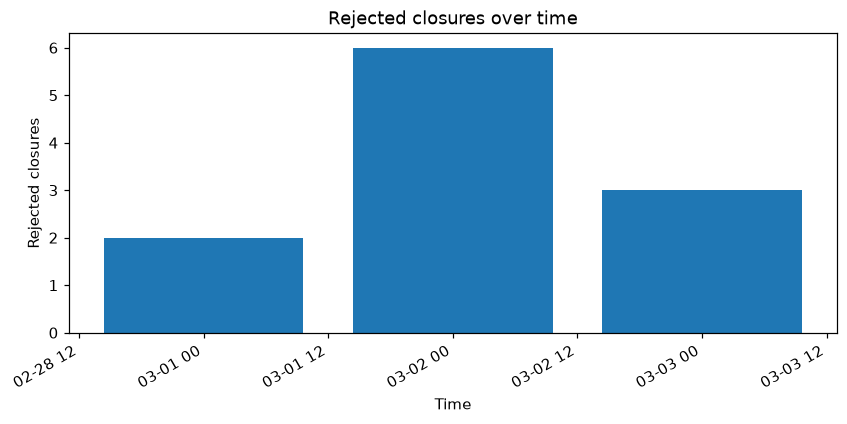

# AROL Telemetry Report

**Generated:** 2026-09-04T16:08:50.949421+00:00
**Dataset pool:** 2026-03
**Request:** Generate a drift report: has torque drifted from baseline for any head, and how has success rate evolved over time?

---

All data collected. Here is the full drift report:

---

# AROL Telemetry Drift Report — March 2026

**Goal:** Determine whether closing torque has drifted from baseline for any capping head, and characterise how the overall success rate evolved across the month.

**Data used:** March 2026 dataset pool (2026-03-01 through 2026-03-03 as recorded; 36 heads, H01–H36). Tools called: `detect_drift`, `torque_statistics_per_head`, `success_rate_over_time` (daily, 1D), `torque_moving_average`, `overall_success_rate`, plus four plot tools.

---

## Analyses Executed

- **Drift detection** — z-score comparison of each head's recent torque mean vs. its own historical baseline
- **Per-head torque statistics** — mean, min, max, std across all successful closures
- **Daily success rate** — attempted vs. successful vs. rejected, each calendar day
- **Torque moving average** — expanding mean over successive closures, fleet-wide
- **Overall success rate** — fleet aggregate for the full period
- **Visualisations** — torque over time (scatter), daily failed closures (bar), success rate per head (bar)

---

## Findings

### 1. Torque Drift — No Drift Detected on Any Head

The z-score drift detector evaluated all 36 heads against their own per-head baselines. **Zero heads triggered a drift alert.**

| Metric | Value |
|---|---|
| Heads evaluated | 36 |
| Heads with drift detected | **0** |
| Highest z-score observed | 0.05 (H14, H15, H16, H11) |
| Lowest z-score observed | 0.02 (H27, H34) |

All z-scores fall between **0.02 and 0.05**, far below the detection threshold. This indicates torque has been extremely stable relative to each head's own baseline throughout the month.

**Per-head torque summary (successful closures):**
- **Mean torque:** 2.20 Nm across all 36 heads — virtually identical fleet-wide
- **Std range:** 0.06 – 0.09 Nm (tight, consistent spread)
- **Max torque peaks:** Most heads peak at 2.21 Nm; exceptions worth noting:
  - **H16:** max 2.34 Nm
  - **H35:** max 2.42 Nm ← highest single-event torque in the fleet
  - **H09, H18:** max 2.29 Nm
  - **H30:** max 2.28 Nm
  - **H02:** max 2.23 Nm
- **Min torque:** 0.0 Nm on every head — indicating zero-torque events exist (these are typically No Load or sensor artefacts; a zero-torque summary check is recommended as a follow-up)

The moving average traces confirm stability: across the 200 sampled early-period rows, all heads track closely within 2.194–2.204 Nm with no divergence trend visible.

**Torque over time (scatter, all successful closures):**

---

### 2. Success Rate Over Time — Near-Perfect Throughout

| Date | Attempted | Successful | Rejected | Success Rate |
|---|---|---|---|---|
| 2026-03-01 | 163,125 | 163,123 | 2 | **100.0%** |
| 2026-03-02 | 360,453 | 360,447 | 6 | **100.0%** |
| 2026-03-03 | 216,108 | 216,105 | 3 | **100.0%** |
| **Fleet total** | **739,686** | **739,675** | **11** | **100.0%** |

The success rate has been effectively **100.0% every day** in the dataset. Only **11 rejected closures** (reject_signal = YES) occurred across the entire 739,686-attempt population — a reject rate of **0.0015%**. There were **zero fault-status events**.

**Daily rejected closures chart:**

**Success rate per head:**

---

## Confidence & Limits

- **Dataset coverage:** The dataset contains only **3 days** (2026-03-01 to 2026-03-03), despite being labelled as the March 2026 pool. If additional daily files exist for the rest of March, they were not loaded and this report does not represent the full month. The drift detector's "recent vs. baseline" comparison is therefore compressed into a very short window, which may reduce its sensitivity to slow gradual drift.
- **Zero-torque min on all heads:** Every head records a 0.0 Nm minimum, even in the successful-only torque filter. This could indicate zero-torque readings passed through the status-code classification as successes — a data quality concern worth investigating.
- **Drift z-score uniformity:** The z-scores are strikingly uniform across all heads (0.02–0.05), suggesting the baseline and recent windows may be very similar in length. A longer historical baseline would yield a more discriminating drift comparison.
- **Moving average truncated:** The `torque_moving_average` tool returned only the first 200 of 739,675 rows; the trend shown covers only the first few seconds of 2026-03-01 and cannot confirm late-month stability directly.

---

## Next Checks

1. **Investigate zero-torque successful closures** — Run `zero_torque_summary` to quantify how many zero-torque events exist per head, and `torque_status_consistency_check` to verify these aren't successful-status events with a genuine zero reading (data-quality risk).
2. **Scope drift detection to H35 and H16** — These two heads showed the highest max torque peaks (2.42 Nm and 2.34 Nm respectively). Run `torque_moving_average` scoped to each (`head_id: "H35"`, `head_id: "H16"`) to see whether those spikes are isolated outliers or a rising trend.
3. **Confirm full March data is loaded** — If the pool is supposed to cover the entire month, verify why only 3 days are present. Loading the full month would give the drift detector a meaningful baseline-vs-recent window and could surface slow trends invisible in 3 days.

---

## Tool-call trace

1. `detect_drift({})`

2. `torque_statistics_per_head({'successful_only': True})`

3. `success_rate_over_time({'freq': '1D', 'start_date': '2026-03-01', 'end_date': '2026-03-31'})`

4. `torque_moving_average({'start_date': '2026-03-01', 'end_date': '2026-03-31'})`

5. `overall_success_rate({})`

6. `plot_torque_over_time({})`

7. `plot_failed_closures_over_time({'freq': '1D'})`

8. `plot_success_rate_per_head({})`

