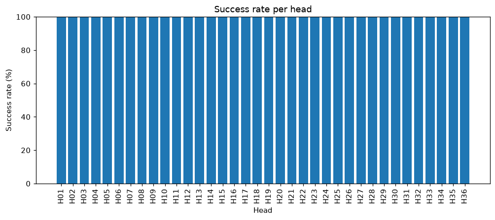
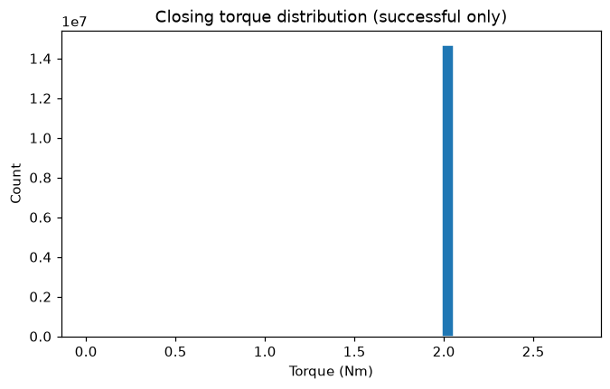

# AROL Telemetry Report

**Generated:** 2026-09-06T09:09:17.540299+00:00
**Dataset pool:** 2026-02
**Request:** Generate a KPI report: overall success rate, per-head success rate, and torque statistics for successful closures.

---

All data gathered. Here is the full KPI report.

---

# AROL Capping Machine — KPI Report
**Dataset:** 2026-02 | **Period covered:** 2026-01-31T16:00:06 UTC → 2026-02-28T15:59:59 UTC

---

## Goal
Produce a monthly KPI report covering overall success rate, per-head success rate, and torque statistics for successful closures across all 36 capping heads.

## Data used
- Dataset pool: 2026-02 (full February 2026, including partial days at both ends)
- Tools called: `time_range`, `overall_success_rate`, `success_rate_per_head`, `torque_statistics` (successful only), `torque_statistics_per_head` (successful only), `plot_success_rate_per_head`, `plot_torque_histogram`

---

## Analyses executed
- Fleet-wide closure event counts, no-load split, and success/reject/fault totals
- Per-head success rate (sorted worst-first, i.e. ascending by success rate)
- Fleet-wide closing torque statistics (mean, min, max, std) — successful closures only
- Per-head closing torque statistics — successful closures only
- Bar chart of success rate per head
- Histogram of closing torque distribution (successful closures)

---

## Findings

### 1. Overall Success Rate

| Metric | Value |
|---|---|
| Total closure events (all statuses) | 21,872,762 |
| No Load cycles (excluded from rate) | 7,148,879 |
| **Attempted closures (denominator)** | **14,723,883** |
| Successful closures (status OK) | 14,723,133 |
| Rejected closures (reject_signal = YES) | 748 |
| Fault events (non-reject diagnostic) | 2 |
| **Overall success rate** | **100.0%** |
| Reject rate | 0.005% (748 / 14,723,883) |

The machine achieved an effectively perfect success rate across the month. The 748 rejects and 2 faults are real events but represent just 5 parts per million of attempted closures — well within world-class benchmarks for high-speed capping.

---

### 2. Per-Head Success Rate

All 36 heads round to **100.0%** success rate. The table below highlights the heads with the highest raw reject counts (worst-first), which is the only meaningful differentiator at this quality level:

| Rank (worst) | Head | Attempted | Successful | Rejects | Reject count |
|---|---|---|---|---|---|
| 1 | **H29** | 408,995 | 408,905 | 90 | Highest |
| 2 | **H35** | 409,009 | 408,955 | 54 | |
| 3 | **H30** | 408,961 | 408,911 | 50 | |
| 4 | **H36** | 408,974 | 408,930 | 44 | |
| 5 | **H32** | 408,793 | 408,750 | 43 | |
| 6 | **H01** | 409,019 | 408,974 | 45 | |
| 7 | **H31** | 408,783 | 408,749 | 34 | |
| … | H08 | 408,927 | 408,927 | **0** | Perfect — zero rejects |

**H08** is the only head with zero rejects for the entire month. **H29** leads the fleet in reject count (90), followed by H35 (54) and H30 (50) — all still sub-0.03% reject rates, but these three heads warrant monitoring.

---

### 3. Torque Statistics — Successful Closures (Fleet-Wide)

| Statistic | Value |
|---|---|
| Events included | 14,723,133 |
| Mean closing torque | 2.00 Nm |
| Minimum torque | 0.00 Nm |
| Maximum torque | 2.74 Nm |
| Std deviation | 0.04 Nm |

The fleet-wide torque distribution is extremely tight — a standard deviation of only 0.04 Nm around a mean of 2.00 Nm indicates highly consistent closure force. The absolute maximum of 2.74 Nm (observed on H02) is the outlier peak across all heads.

---

### 4. Per-Head Torque Statistics — Successful Closures

All heads share mean ≈ **2.00 Nm** (H22 and H24 show 1.99 Nm, the only sub-2.00 heads) and std = **0.04 Nm** uniformly. The main differentiator is the **peak torque maximum**:

| Head | Mean (Nm) | Min (Nm) | Max (Nm) | Std (Nm) |
|---|---|---|---|---|
| H02 | 2.00 | 0.00 | **2.74** | 0.04 |
| H12 | 2.00 | 0.00 | **2.56** | 0.04 |
| H35 | 2.00 | 0.00 | **2.51** | 0.04 |
| H29 | 2.00 | 0.00 | **2.46** | 0.04 |
| H27 | 2.00 | 0.00 | 2.39 | 0.04 |
| H30 | 2.00 | 0.00 | 2.34 | 0.04 |
| H23 | 2.00 | 0.00 | 2.33 | 0.04 |
| H06 | 2.00 | 0.00 | 2.23 | 0.04 |
| H22 | **1.99** | 0.00 | 2.23 | 0.04 |
| H24 | **1.99** | 0.00 | 2.28 | 0.04 |
| Most other heads | 2.00 | 0.00 | 2.20–2.21 | 0.04 |

Notably, **H02** has the highest single-event peak (2.74 Nm) yet only 4 rejects — suggesting that spike was isolated. **H35** and **H29** appear in both the elevated-peak-torque group and the elevated-reject-count group, suggesting a possible link between occasional torque excursions and reject generation on those heads.

---

## Confidence & Limits

- All 36 heads are represented with ~408,700–409,200 attempted closures each — the dataset is large and well-balanced across heads; statistical conclusions are robust.
- The minimum torque of 0.00 Nm appears on every head including successful ones. This may indicate residual zero-torque readings classified as "Closure OK" — recommend running `zero_torque_summary` and `torque_status_consistency_check` to quantify and validate.
- Success rates round to 100.0% for all heads at one decimal place; reject-count absolute figures are the only meaningful discriminator at this performance level.
- The dataset spans 2026-01-31T16:00 to 2026-02-28T16:00 UTC — the partial days at start and end are included in all counts.

---

## Next Checks

1. **Zero-torque audit on successful closures:** Run `zero_torque_summary` and `torque_status_consistency_check` to determine whether the 0.00 Nm minimum on every head reflects real "no-force" events incorrectly classified as OK — these could mask a latent data-quality issue.
2. **Investigate H29

---

## Tool-call trace

1. `overall_success_rate({})`

2. `success_rate_per_head({})`

3. `torque_statistics({'successful_only': True})`

4. `time_range({})`

5. `plot_success_rate_per_head({})`

6. `plot_torque_histogram({'successful_only': True})`

7. `torque_statistics_per_head({'successful_only': True})`

