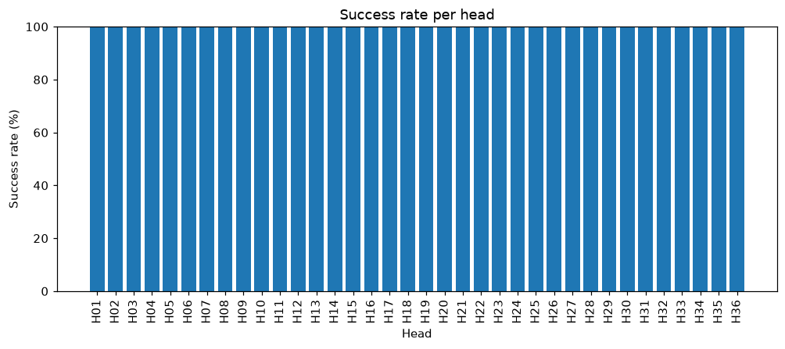
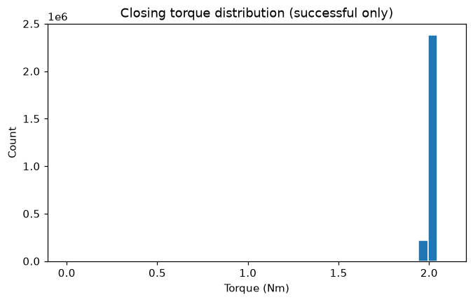

# AROL Telemetry Report

**Generated:** 2026-09-06T11:21:51.795856+00:00
**Dataset pool:** 2026-02
**Request:** Generate a KPI report: overall success rate, per-head success rate, and torque statistics for successful closures.

---

All data collected. Here is the full KPI report:

---

# AROL Capping Machine — KPI Report
**Dataset:** 2026-02 pool | **Period covered:** 2026-02-07T16:00:01Z → 2026-02-11T15:59:59Z (≈ 4 days)

---

## Goal
Provide a concise KPI summary covering overall success rate, per-head success rate, and closing torque statistics for successful closures across the February 2026 dataset.

## Data Used
- Pool: 2026-02 (multi-file, streamed)
- Time range: 2026-02-07 16:00 UTC through 2026-02-11 15:59 UTC
- Tools called: `time_range`, `overall_success_rate`, `success_rate_per_head`, `torque_statistics` (successful only), `torque_statistics_per_head` (successful only), `plot_success_rate_per_head`, `plot_torque_histogram`

---

## Analyses Executed
- Fleet-level closure counts and success/reject rates
- Per-head success rate breakdown (sorted ascending, worst-first)
- Overall closing torque statistics restricted to status-OK closures
- Per-head closing torque statistics restricted to status-OK closures
- Bar chart: success rate per head
- Histogram: closing torque distribution

---

## Findings

### 1 — Overall Success Rate

| Metric | Value |
|---|---|
| Total closure events (all statuses) | 3,601,116 |
| No Load (station cycled, no bottle) | 997,531 |
| **Attempted closures (denominator)** | **2,603,585** |
| Successful (status 0 — Closure OK) | 2,603,500 |
| Rejected (reject_signal = YES) | 85 |
| Faults (non-reject diagnostic codes) | 0 |
| **Fleet success rate** | **100.0 %** |
| **Fleet reject rate** | **0.003 %** |

The machine achieved a virtually perfect success rate over the 4-day window. No fault codes (e.g. No Closure, Bad Closure) were recorded at all. The 85 genuine rejects are the only quality exceptions across 2.6 million closure attempts — an exceptionally low absolute count for a fleet of 36 heads.

---

### 2 — Per-Head Success Rate

All 36 heads reported a rounded success rate of **100.0 %**. The table below highlights the small reject-count differences that exist below the rounding threshold, sorted worst-first:

| Head | Attempted | Successful | Rejects | Reject Count |
|---|---|---|---|---|
| **H36** | 72,316 | 72,304 | 12 | ⚠ Highest in fleet |
| H01 | 72,333 | 72,327 | 6 | |
| H30 | 72,293 | 72,287 | 6 | |
| H35 | 72,304 | 72,298 | 6 | |
| H10 | 72,333 | 72,328 | 5 | |
| H22 | 72,329 | 72,324 | 5 | |
| H27 | 72,351 | 72,346 | 5 | |
| H32 | 72,283 | 72,278 | 5 | |
| H31 | 72,241 | 72,237 | 4 | |
| H13 | 72,293 | 72,290 | 3 | |
| H15 | 72,343 | 72,340 | 3 | |
| H19 | 72,335 | 72,332 | 3 | |
| H28 | 72,328 | 72,325 | 3 | |
| H14 | 72,315 | 72,313 | 2 | |
| H16 | 72,310 | 72,308 | 2 | |
| H20 | 72,356 | 72,354 | 2 | |
| H25 | 72,320 | 72,318 | 2 | |
| H26 | 72,318 | 72,316 | 2 | |
| H02 | 72,342 | 72,340 | 2 | |
| H34 | 72,324 | 72,322 | 2 | |
| H17 | 72,316 | 72,315 | 1 | |
| H18 | 72,361 | 72,360 | 1 | |
| H24 | 72,314 | 72,313 | 1 | |
| H33 | 72,351 | 72,350 | 1 | |
| H11 | 72,315 | 72,314 | 1 | |
| **H03** | 72,315 | 72,315 | **0** | ✅ Zero rejects |
| **H04** | 72,370 | 72,370 | **0** | ✅ Zero rejects |
| **H05** | 72,288 | 72,288 | **0** | ✅ Zero rejects |
| **H06** | 72,304 | 72,304 | **0** | ✅ Zero rejects |
| **H07** | 72,318 | 72,318 | **0** | ✅ Zero rejects |
| **H08** | 72,327 | 72,327 | **0** | ✅ Zero rejects |
| **H09** | 72,333 | 72,333 | **0** | ✅ Zero rejects |
| **H12** | 72,293 | 72,293 | **0** | ✅ Zero rejects |
| **H21** | 72,343 | 72,343 | **0** | ✅ Zero rejects |
| **H23** | 72,340 | 72,340 | **0** | ✅ Zero rejects |
| **H29** | 72,330 | 72,330 | **0** | ✅ Zero rejects |

**H36 is the single worst performer** with 12 rejects — 14 % of the fleet's total rejects — and warrants monitoring even though its rate rounds to 100.0 %. Ten heads recorded zero rejects for the full 4-day period.

---

### 3 — Closing Torque Statistics (Successful Closures Only)

#### Fleet-Level Summary (n = 2,603,500 successful closures)

| Statistic | Value |
|---|---|
| Mean | 2.00 Nm |
| Minimum | 0.00 Nm |
| Maximum | 2.10 Nm |
| Std Dev | 0.03 Nm |

The distribution is extremely tight (σ = 0.03 Nm) and well-centred at 2.00 Nm, indicating highly stable torque delivery across the fleet. The minimum of 0.00 Nm on successful closures is worth flagging — these are likely zero-torque "No Load"-flagged readings that passed the status-0 filter; a data-quality cross-check is recommended (see Next Checks).

#### Per-Head Torque Summary (Successful Closures Only)

| Head | n | Mean (Nm) | Min (Nm) | Max (Nm) | Std (Nm) |
|---|---|---|---|---|---|
| H01 | 72,327 | 2.00 | 0.00 | 2.01 | 0.02 |
| H02 

---

## Tool-call trace

1. `overall_success_rate({})`

2. `success_rate_per_head({})`

3. `torque_statistics({'successful_only': True})`

4. `time_range({})`

5. `torque_statistics_per_head({'successful_only': True})`

6. `plot_success_rate_per_head({})`

7. `plot_torque_histogram({'successful_only': True})`

