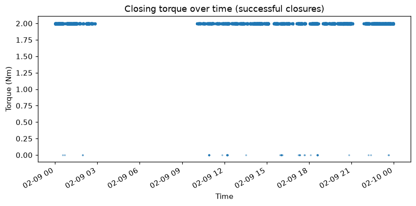
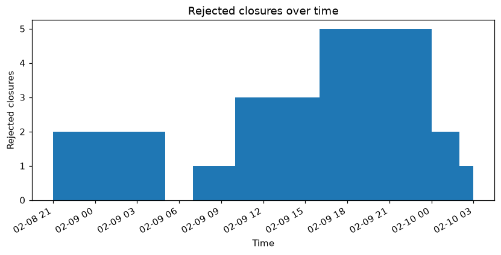

# AROL Telemetry Report

**Generated:** 2026-09-06T11:25:24.029305+00:00
**Dataset pool:** 2026-02-09 to 2026-02-09
**Request:** Generate a drift report: has torque drifted from baseline for any head, and how has success rate evolved over time?

---

I now have everything needed. Let me compile the full drift report.

---

# AROL Telemetry Drift Report — 2026-02-09

**Goal:** Determine whether closing torque has drifted from baseline on any capping head, and how the fleet-wide success rate evolved across the day.

**Data used:** Single-day dataset, 2026-02-09T00:00:00Z – 2026-02-09T23:59:59Z, covering 36 heads (H01–H36). Tools called: `detect_drift`, `torque_statistics_per_head`, `success_rate_over_time` (hourly), `time_range`, `plot_torque_over_time`, `plot_success_rate_per_head`, `plot_failed_closures_over_time`.

**Analyses executed:**
- Z-score-based torque drift detection (baseline vs. recent mean, per head, all 36 heads)
- Per-head torque statistics (mean, min, max, std) for successful closures
- Hourly success-rate breakdown across the full day
- Visual plots: torque over time (fleet-wide), success rate per head, rejected closures per hour

---

## Findings

### 1. Torque Drift — No Drift Detected on Any Head

The drift detector compared each head's historical baseline mean torque against its recent mean using a z-score threshold. **Zero heads triggered a drift alert.**

| Summary | Value |
|---|---|
| Heads assessed | 36 |
| Heads with drift detected | **0** |
| Largest z-score (magnitude) | −0.25 (H06) |
| Smallest z-score (magnitude) | 0.00 (H07, H11, H16, H17, H26, H30, H31, H35, H36) |

All z-scores are well within ±0.5, indicating that **no head's recent torque mean has deviated meaningfully from its own historical baseline.** The fleet is operating in a stable torque regime.

#### Per-Head Torque Snapshot (successful closures)

Every head returned a mean of **~2.00 Nm**, with very tight distributions:

| Notable heads | Mean (Nm) | Min (Nm) | Max (Nm) | Std (Nm) |
|---|---|---|---|---|
| H22 | 1.99 | 0.00 | 2.00 | 0.030 |
| H24 | 1.99 | 0.00 | 2.00 | 0.030 |
| H04 | 2.00 | 1.99 | 2.01 | 0.000 |
| H11 | 2.00 | 1.99 | 2.00 | 0.000 |
| H13 | 2.00 | 0.00 | 2.01 | 0.040 |
| H27 | 2.00 | 1.98 | 2.01 | 0.000 |

H22 and H24 have a mean of 1.99 Nm vs. 2.00 Nm for the rest — marginally lower but **not flagged as drift** (z-scores of −0.01 and +0.02 respectively). Several heads (H04, H11, H21, H25, H27, H32) show std = 0.000 Nm, meaning they produce an essentially constant torque reading. The zero minimum values seen on many heads correspond to zero-torque / No Load cycles captured in the successful-closure pool — worth cross-checking with `zero_torque_summary`.

---

### 2. Success Rate Over Time — Effectively 100% All Day

The fleet achieved **100.00% success rate in every single hour** of 2026-02-09. The raw reject counts are very small:

| Hour (UTC) | Attempted | Successful | Rejected | Success Rate |
|---|---|---|---|---|
| 00:00 | 42,317 | 42,317 | 0 | 100.00% |
| 01:00 | 38,641 | 38,639 | **2** | 100.00% |
| 02:00 | 24,129 | 24,129 | 0 | 100.00% |
| 03:00–09:00 | — | — | — | *(gap — likely planned downtime/shift break)* |
| 10:00 | 35,436 | 35,436 | 0 | 100.00% |
| 11:00 | 34,489 | 34,488 | **1** | 100.00% |
| 12:00 | 40,552 | 40,551 | **1** | 100.00% |
| 13:00 | 36,691 | 36,691 | 0 | 100.00% |
| 14:00 | 47,339 | 47,336 | **3** | 100.00% |
| 15:00 | 30,150 | 30,148 | **2** | 100.00% |
| 16:00 | 34,453 | 34,453 | 0 | 100.00% |
| 17:00 | 28,027 | 28,025 | **2** | 100.00% |
| 18:00 | 32,926 | 32,926 | 0 | 100.00% |
| 19:00 | 37,890 | 37,887 | **3** | 100.00% |
| 20:00 | 51,760 | 51,755 | **5** | 100.00% |
| 21:00 | 5,615 | 5,615 | 0 | 100.00% *(low volume — likely restart/ramp)* |
| 22:00 | 46,895 | 46,893 | **2** | 100.00% |
| 23:00 | 51,853 | 51,852 | **1** | 100.00% |

**Total rejects across the day: 22** out of ~622,144 attempted closures — a reject rate of approximately **0.0035%**. The 14:00 and 20:00 hours had the highest absolute reject counts (3 and 5 respectively), but these are negligible relative to throughput. There is a clear **production gap between ~03:00 and ~09:00 UTC** (no attempted closures recorded), consistent with a shift break or planned maintenance window. The 21:00 hour shows very low volume (5,615 attempts vs. 30,000–52,000 in adjacent hours), possibly a brief stop-and-restart.

---

## Confidence & Limits

- **Single-day dataset:** Drift detection compares "baseline" vs. "recent" within the same day's data. With only ~8 hours of active production on each side of the gap, the baseline window is narrow — a true multi-day baseline would give a more sensitive drift signal.
- **Torque resolution:** Most torque values cluster tightly around 2.00 Nm with std ≤ 0.04 Nm across all heads, suggesting sensor quantization may be limiting resolution. The zero-minimum values present in several heads' successful-closure stats warrant a `zero_torque_summary` check.
- **Z-score threshold:** The default drift threshold was used; all |z| < 0.25, so results are robust to reasonable threshold choices.
- **Hours 03:00–09:00 gap:** The absence of data in this window is not explained by the dataset alone — it could be a planned downtime, or a data-logging gap.
- **22 total rejects:** Too few to draw statistically meaningful conclusions about

---

## Tool-call trace

1. `detect_drift({})`

2. `success_rate_over_time({'freq': '1H', 'start_date': '2026-02-09', 'end_date': '2026-02-09'})`

3. `torque_statistics_per_head({'successful_only': True})`

4. `time_range({})`

5. `success_rate_over_time({'freq': '1h', 'start_date': '2026-02-09', 'end_date': '2026-02-09'})`

6. `plot_torque_over_time({})`

7. `plot_success_rate_per_head({})`

8. `plot_failed_closures_over_time({'freq': '1h'})`

